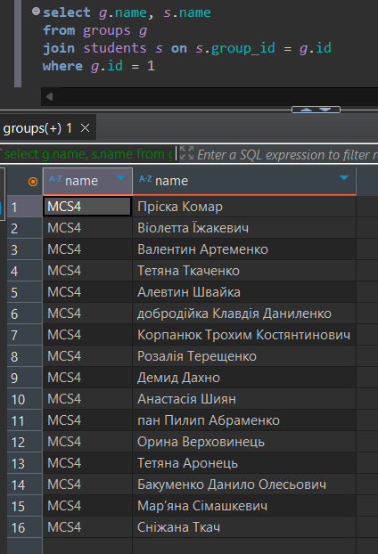

# HW 6

## Query 1: Get the top 5 students with the highest average mark in all subjects.

---

## Query 2: Get the student with the highest average mark in a specific subject.

---

## Query 3: Get the average mark in groups for a specific subject.

---

## Query 4: Get the average mark in the stream (across all marks).

---

## Query 5: Get the subjects taught by a specific teacher.

---

## Query 6: Get the list of students in a specific group.

---

## Query 7: Get the marks of students in a specific group for a specific subject.

---

## Query 8: Get the average mark given by a specific teacher across their subjects.

---

## Query 9: Get the list of subjects attended by a specific student.

---

## Query 10: Get the list of subjects taught by a specific teacher to a specific student.

---